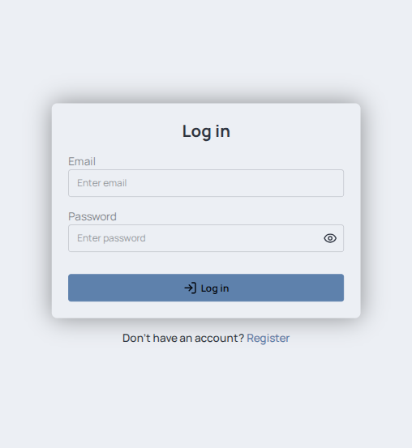
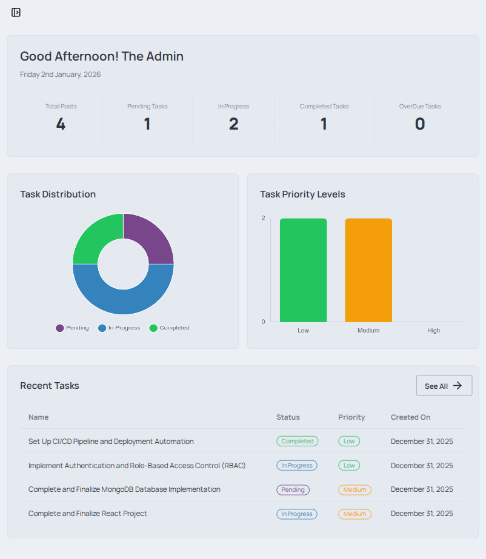

# Project On Task Manager System Using React & MongoDB

A modern, production-ready Task Manager Application designed to help users efficiently create, organize, and track tasks. This project demonstrates real-world application architecture, secure authentication, protected routes, and scalable frontend–backend communication.


## 🌐 Deployment

**Deployed Website Link:** 
[react-task-manager-mocha.vercel.app](https://react-task-manager-mocha.vercel.app/)


## 🚀 Features

- JWT Based User Authentication (Login / Register)
- Role-Based Access Control (Admin / User)
- Create, Read, Update, Delete (CRUD) Tasks
- Task Status & Priority Management
- Advanced Filtering & Search
- Protected Routes
- API Request Handling with Error Management
- Ability To Send Gmail On Loggin In
- Responsive UI
- Ability To Download Reports As Excel File


## 🛠️ Tech Stack

**Frontend (Client):** React, React Router DOM, TailwindCSS, Axios, Vite

**Backend (Api):** Node, MongoDB

**Other Tools:** JWT Authentication, RESTful APIs


##  📁 Project Structure

```
├── client/
│ └──  src/
│   ├── components
│   ├── layouts
│   ├── pages
│   ├── contexts
│   ├── hooks
│   ├── lib
│   ├── network
│   ├── reducers
│   └── utils 
│ 
├── api/
│ └── src/
│   ├── config
│   ├── controllers
│   ├── middlewares
│   ├── routes
│   ├── services
│   ├── templates
│   ├── models
│   └── utils
│
└── README.md
```
## ⚙️ Installation & Setup

**Prerequisites:** Node.js(v20+), MongoDB, Git

**Branch Name:** main

**Clone The Repository:**

```bash
git clone https://github.com/TamalPakrasi/react-task-manager.git
cd react-task-manager
```

**Backend (api) Setup:**

```bash
cd api
npm install
npm run dev
```

**Frontend (client) Setup:**

```bash
cd client
npm install
npm run dev
```
## 🔐 Environment Variables

Create `.env` files in the both directories:

> Follow the `.env.sample` file mentioned in each directories

## 🔐 Demo Credentials

**Use the following credentials to explore the application without creating an account:**

**Admin**
- Email: `admin@demo.com`
- Password: `admin123`

**Members**


| # | Email               | Password   |
|---|---------------------|------------|
| 1 | `member1@demo.com`  | `member123` |
| 2 | `member2@demo.com`  | `member123` |
| 3 | `member3@demo.com`  | `member123` |
| 4 | `member4@demo.com`  | `member123` |
| 5 | `member5@demo.com`  | `member123` |


## 📸 Screenshots

<p align="center">
  
  
</p>

## 📝 Key Learnings

* Implemented secure authentication and authorization
* Built scalable and reusable React components
* Managed global state using Context API
* Designed clean backend architecture (Express Like)
## 👤 Author

* GitHub: [github.com/TamalPakrasi](https://github.com/TamalPakrasi)
* LinkedIn: [linkedin.com/in/tamal-pakrasi-0224b8338](www.linkedin.com/in/tamal-pakrasi-0224b8338)
